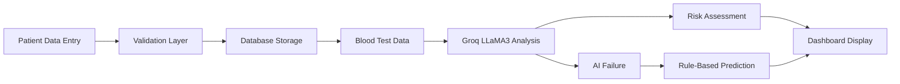

# 🏥 HealthAI — AI-Powered Healthcare Risk Prediction Dashboard

<div align="center">


### Intelligent Healthcare Management & Risk Assessment Platform

Manage patient records, analyze blood test results, and generate AI-powered health risk predictions using Groq LLaMA3.

</div>

---

## 🚀 Live Demo

### 🌐 Application

https://healthcare-eaqw.onrender.com

### 💻 GitHub Repository

https://github.com/sanika047/HealthCare

---

# 📌 Overview

HealthAI is a full-stack healthcare web application designed to help healthcare professionals and researchers manage patient records and generate intelligent health risk assessments.

The platform combines:

* Flask Backend
* SQLAlchemy ORM
* SQLite / PostgreSQL Database
* Groq LLaMA3 AI Integration
* Interactive Dashboard Analytics
* Responsive Frontend UI

The system allows users to store patient information, analyze blood test data, and receive AI-generated health insights in real time.

---

# ✨ Features

## 👤 Patient Management

* Add new patient records
* View detailed patient information
* Update existing records
* Delete patient records
* Search and manage patient data efficiently

---

## 🤖 AI Health Risk Prediction

HealthAI uses Groq's LLaMA3 model to analyze patient blood parameters and generate:

* Health risk assessments
* Personalized health observations
* Potential risk indicators
* Preventive recommendations

### Fallback Prediction Engine

If the AI service is unavailable:

✅ Rule-based analysis automatically takes over

This ensures uninterrupted functionality and consistent predictions.

---

## 📊 Dashboard Analytics

The dashboard provides real-time insights such as:

* Total Patients
* Average Hemoglobin Levels
* Average Blood Sugar Levels
* Average Cholesterol Values
* Overall Dataset Statistics

---

## ✅ Input Validation

Robust backend validation includes:

* Email validation
* Date of birth validation
* Prevention of future DOB entries
* Required field checks
* Numeric parameter validation
* Invalid data rejection

---

## 🎨 Modern Responsive UI

Features:

* Healthcare-themed interface
* Mobile responsive design
* Clean user experience
* Interactive dashboard
* Simple navigation

Built using:

* HTML5
* CSS3
* Vanilla JavaScript

---

# 🧠 AI Workflow



---

# 🏗️ System Architecture

```text
Frontend (HTML/CSS/JS)
        │
        ▼
Flask Application
        │
        ▼
SQLAlchemy ORM
        │
 ┌──────┴──────┐
 ▼             ▼

SQLite      PostgreSQL
(Dev)       (Production)

        │
        ▼

Groq API (LLaMA3)
        │
        ▼

AI Health Predictions
```

---

# 🛠️ Technology Stack

## Backend

* Python
* Flask
* SQLAlchemy
* Flask-CORS
* Gunicorn

## Database

### Development

* SQLite

### Production

* PostgreSQL

## AI & Machine Learning

* Groq API
* LLaMA3-8B Model

## Frontend

* HTML5
* CSS3
* JavaScript

## Deployment

* Render
* GitHub

---

# 📁 Project Structure

```bash
HealthCare/
│
├── app.py
├── requirements.txt
├── Procfile
├── runtime.txt
├── .env.example
│
├── templates/
│   └── index.html
│
├── static/
│   ├── css/
│   │   └── style.css
│   │
│   └── js/
│       └── app.js
│
└── README.md
```

---

# ⚙️ Local Installation

## 1️⃣ Clone Repository

```bash
git clone https://github.com/sanika047/HealthCare.git

cd HealthCare
```

---

## 2️⃣ Create Virtual Environment

### Windows

```bash
python -m venv venv

venv\Scripts\activate
```

### Mac/Linux

```bash
python3 -m venv venv

source venv/bin/activate
```

---

## 3️⃣ Install Dependencies

```bash
pip install -r requirements.txt
```

---

## 4️⃣ Configure Environment Variables

Create a `.env` file:

```env
GROQ_API_KEY=your_groq_api_key

DATABASE_URL=your_database_url

FLASK_ENV=development
```

---

## 5️⃣ Run Application

```bash
python app.py
```

Application will be available at:

```text
http://localhost:5000
```

---

# 🔑 Environment Variables

| Variable     | Description                           |
| ------------ | ------------------------------------- |
| GROQ_API_KEY | API key for Groq LLaMA3               |
| DATABASE_URL | PostgreSQL database connection string |
| FLASK_ENV    | Development or Production mode        |

---

# 📡 API Capabilities

The application supports:

### Patients

* Create Patient
* Read Patient
* Update Patient
* Delete Patient

### Health Assessment

* AI Prediction
* Rule-Based Prediction
* Dashboard Statistics

---

# 📸 Screenshots

## Dashboard

Replace with your screenshot:

```html

```

---

## Patient Management

```html

```

---

## AI Prediction Result

```html

```

---

# 🚀 Deployment

The application is deployed on Render.

Deployment includes:

* Automatic GitHub Integration
* Gunicorn Production Server
* PostgreSQL Support
* Environment Variable Management
* Continuous Deployment

---

# 🎯 Learning Outcomes

This project demonstrates:

* Full-Stack Development
* Flask Application Architecture
* CRUD Operations
* RESTful Design Principles
* SQLAlchemy ORM Usage
* AI API Integration
* Prompt Engineering
* Data Validation Techniques
* Cloud Deployment
* Production Environment Setup

---

# 🔮 Future Enhancements

Planned improvements:

* User Authentication
* Doctor & Patient Roles
* Medical Report Uploads
* PDF Report Generation
* Data Export Functionality
* Health Trend Visualization
* Advanced Predictive Analytics
* Appointment Scheduling Module

---

# 👩‍💻 Author

## Sanika Gurav

GitHub:
https://github.com/sanika047

LinkedIn:
(Add Your LinkedIn Profile)

---

# 🤝 Contributing

Contributions are welcome.

1. Fork the repository
2. Create a feature branch
3. Commit changes
4. Push to GitHub
5. Open a Pull Request

---

# ⭐ Support

If you found this project useful:

⭐ Star the repository

🍴 Fork the project

📢 Share it with others

---

# 📜 License

This project is developed for educational, learning, and portfolio purposes.

© 2026 Sanika Gurav
